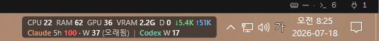
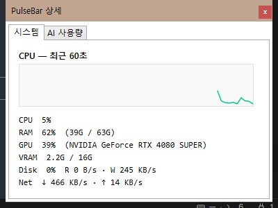
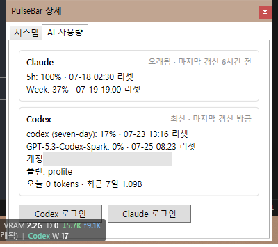

<div align="center">

# ⚡ PulseBar

**내 시스템, 내 AI 쿼터. 작업표시줄에서 한 눈에.**

*시스템 트레이 옆에 상주하며 실시간 시스템 지표와 **Claude Code** · **Codex** 사용 한도를 보여주는 초경량 Windows 위젯 — 작업 중간에 rate limit에 기습당하는 일, 이제 없습니다.*

[](https://github.com/Hitbee-dev/PulseBar/releases/latest)
[](https://github.com/Hitbee-dev/PulseBar/releases)
[](LICENSE)
[](https://dotnet.microsoft.com/)
[](https://github.com/Hitbee-dev/PulseBar/releases/latest)
[](tests)
[](https://github.com/Hitbee-dev/PulseBar/pulls)

[English](README.md) · **한국어**



`CPU · RAM · GPU · VRAM · 디스크 · 네트워크` &nbsp;+&nbsp; `Claude 5시간/주간` &nbsp;+&nbsp; `Codex 한도` — **매초 갱신, 작업표시줄 위에서.**

</div>

---

## 💡 왜 PulseBar인가?

**Claude Code**나 **Codex**로 코딩할 때 진짜 제약은 눈에 안 보입니다: *5시간 창이 얼마나 남았지? 주간 한도는 언제 리셋되지? 에이전트 돌아가는 동안 이 PC 스왑 중인 건 아니야?* 확인하려고 Alt-Tab 하는 순간 흐름이 끊깁니다.

PulseBar는 이 모든 것을 **시계 옆 두 픽셀 거리**에 둡니다 — 그것도 **공식 인터페이스만** 사용해서 (Claude Code statusline & OpenTelemetry, `codex app-server` JSON-RPC). 스크래핑 없음, 자격 증명 접근 없음, RAM 400MB 먹는 Electron 없음.

## ✨ 주요 기능

- 🖥️ **실시간 시스템 지표** — CPU, RAM, GPU, VRAM, 디스크 활성도, 네트워크 속도를 네이티브 Windows API(영문 PDH 카운터 + DXGI)로 매초 샘플링. GPU%는 작업 관리자와 같은 busiest-engine 집계라 숫자가 기대와 어긋나지 않습니다.

- 🤖 **Claude Code 쿼터 실시간 표시** — Claude Code statusline이 제공하는 공식 5시간/주간 사용률과 정확한 리셋 시각. 데이터 나이가 그대로 보입니다: 10분이 지나면 *오래됨*으로 표시되고, 절대 현재값인 척하지 않습니다.

- 🧩 **기존 statusline HUD와 공존** — claude-hud나 커스텀 statusline을 쓰고 계신가요? 동의 한 번이면 PulseBar가 기존 명령을 *래핑*합니다: HUD는 이전과 똑같이 렌더링되고 PulseBar는 지나가는 JSON을 읽기만 합니다. 원본 명령은 그대로 보존, `settings.json`은 선 백업, 덮어쓰기는 절대 없음.

- 🚦 **Codex 한도 + 원클릭 로그인** — 공식 `codex app-server`가 보고하는 모든 rate-limit 버킷(창 길이 기준 분류라 새 버킷도 자동 인식), 플랜, 크레딧, 일별/누적 토큰 활동. 미로그인이면 클릭 한 번에 공식 브라우저 로그인이 열리고, 완료 즉시 숫자가 나타납니다.

- 🧮 **로컬 토큰 텔레메트리** — 이 PC의 Claude Code가 실제로 소비한 모델별 토큰(입력/출력/캐시읽기/캐시생성)을 오늘/최근 7일로 집계 — Claude Code 공식 OpenTelemetry를 루프백 전용 수신기로 받습니다. 사용자가 직접 *Claude 로그인*을 클릭할 때만 설정되며 자동으로 켜지지 않습니다. **프롬프트와 응답은 절대 수집하지 않습니다.**

- 🐧 **Windows + WSL 완전 지원** — Windows와 모든 WSL 배포판에서 `claude`/`codex` 자동 탐지. 버전 인지형: snap, nvm, `~/.local/bin` 설치가 공존하면 각각을 조사해 최신을 선택 — 최신 서버 API와 안 맞는 구버전 바이너리는 자동으로 걸러냅니다.

- 📊 **상세 팝업** — 좌클릭 한 번에 60초 CPU 그래프, 시스템 전체 상세, 프로바이더별 카드(리셋 시각·플랜·계정·크레딧·토큰 합계).

- 🌏 **한국어 / 영어 UI** — 설정에서 즉시 전환.

- 🔒 **설계 단계부터 프라이버시** — 루프백 전용 리스너, DPAPI 보호 시크릿, 외부 전송 제로, 자격 증명 접근 제로. [보안](#-보안과-프라이버시) 참고.

- 🪶 **초경량** — WPF 앱 하나. 유휴 CPU < 0.5%, 관리자 권한 불필요, 서비스 없음, Docker 없음.

## 📸 스크린샷

| 🖥️ 시스템 탭 — 60초 CPU 그래프 | 🤖 AI 사용량 탭 — 프로바이더 카드 |
|:---:|:---:|
|  |  |

## 🚀 빠른 시작

> **요구 사항:** Windows 10/11 x64 · 관리자 권한 불필요 · 런타임 설치 불필요 (self-contained)

### 방법 1 — 다운로드 (권장)

1. [**최신 릴리스**](https://github.com/Hitbee-dev/PulseBar/releases/latest)에서 **`PulseBar-portable-win-x64.zip`** 다운로드
2. 원하는 곳에 압축 해제 → **`PulseBar.exe`** 실행
3. 시스템 지표가 즉시 작업표시줄에 나타납니다 ✨

### 방법 2 — 소스 빌드

```powershell
git clone https://github.com/Hitbee-dev/PulseBar.git
cd PulseBar
powershell -ExecutionPolicy Bypass -File packaging/portable/build-portable.ps1
# → artifacts/PulseBar-portable-win-x64.zip (+ SHA-256)
```

### AI 도구 연결 (1회, 약 30초)

| 단계 | 조작 | 결과 |
|---|---|---|
| 1 | 트레이 우클릭 → **Codex 로그인** | 공식 브라우저 로그인; 완료 즉시 한도 표시 |
| 2 | 트레이 우클릭 → **Claude 로그인** | 클릭 한 번으로 사용량 브리지(statusline)와 로컬 토큰 텔레메트리(공식 OTel)를 함께 연동. 기존 HUD는 동의 후에만 래핑되고, 거부하면 설정을 건드리지 않습니다. Claude Code 1회 재시작 |

## 📖 바 읽는 법

```
CPU 11  RAM 62  GPU 39  VRAM 3.5G  D 0  ↓5K ↑14K
Claude 5h 69 · W 33  |  Codex W 12
```

| 토큰 | 의미 |
|---|---|
| `CPU 11` / `RAM 62` / `GPU 39` | 사용률 % (GPU = 주 어댑터의 busiest engine) |
| `VRAM 3.5G` | 전용 비디오 메모리 사용량 |
| `D 0` | 디스크 활성도 % |
| `↓5K ↑14K` | 초당 네트워크 다운/업 |
| `Claude 5h 69 · W 33` | 5시간 창 69%, 주간 창 33% 사용 |
| `Codex W 12` | Codex 주간 한도 12% 사용 |

수집 불가 값은 `—` (가짜 `0` 없음) · 오래된 값은 명시 표시 · **마우스 오버** = 리셋 시각/토큰 툴팁 · **좌클릭** = 상세 · **우클릭** = 메뉴.

## ⚖️ 절대 혼동하면 안 되는 두 숫자

```
Claude 주간 사용률 33%        ← 서버 계정 쿼터 (공식 값)
Fable 최근 7일 12.4M tokens   ← 이 PC의 로컬 텔레메트리 (다른 기기/웹 미포함)
```

이 둘을 하나의 "퍼센트"로 섞는 도구는 추측을 파는 겁니다. PulseBar는 시각적으로도 의미적으로도 항상 분리합니다.

## 🔐 보안과 프라이버시

| 원칙 | 구현 |
|---|---|
| 자격 증명 무접근 | Codex 인증은 `codex app-server` 내부에, Claude 인증은 Claude Code 내부에. 쿠키/자격 증명 관리자 접근 없음 |
| 내용 무수집 | 토큰 **개수**와 요청 메타데이터만 — 프롬프트/응답/대화는 읽지도 저장하지도 않음 |
| 루프백 전용 | OTLP 수신기는 `127.0.0.1` 바인드 + DPAPI 보호 bearer 시크릿 |
| 안전한 설정 수정 | 타임스탬프 백업 → 없을 때만 추가 → 원자적 쓰기. 기존 설정은 명시적 동의 없이 불변 |
| 외부 전송 없음 | PulseBar는 어디로도 텔레메트리를 보내지 않음 |
| 무권한 · 무주입 | 일반 사용자 권한으로 실행; Explorer 주입/작업표시줄 패치 없음 |

전체 정책: [docs/security.md](docs/security.md)

## 🛠️ 개발

```powershell
dotnet build PulseBar.sln -c Release
dotnet test  PulseBar.sln -c Release --no-build   # 테스트 190개
```

| 프로젝트 | 역할 |
|---|---|
| `PulseBar.App` | WPF 호스트 — 오버레이, 상세 팝업, 트레이, DI |
| `PulseBar.Core` | 모델, 프로바이더 계약, 설정, 다국어, 포매터 |
| `PulseBar.Windows` | PDH/DXGI 메트릭, taskbar interop, CLI 탐지, DPAPI |
| `PulseBar.Providers.Codex` | `codex app-server` JSON-RPC 클라이언트 + 로그인 |
| `PulseBar.Providers.Claude` | statusline 브리지/설치기, OTel 파서 |
| `PulseBar.Bridge` | statusline & WSL OTel 헬퍼 실행 파일 |
| `PulseBar.Storage` | SQLite 토큰 이벤트 저장소 (멱등, 30일 보존) |

**스택:** .NET 8 LTS · WPF · SQLite · xUnit — Electron, 웹뷰, 상시 Node/Python 데몬, Docker, 관리자 드라이버는 **의도적으로 배제**.

## 🗺️ 로드맵

- [ ] 보조 모니터 작업표시줄 지원
- [ ] Provider Adapter 계약으로 프로바이더 확장 — **Gemini CLI**, **GitHub Copilot**, **Cursor**
- [ ] 색상 임계값 및 표시 항목 커스터마이즈 UI
- [ ] 서명 바이너리 + winget 패키지

아이디어 환영 → [이슈 열기](https://github.com/Hitbee-dev/PulseBar/issues)

## 🧰 문제 해결

statusline 병합, 오래됨 표시의 의미, 카운터 가용성 등은 [docs/troubleshooting.md](docs/troubleshooting.md)에 있습니다. 로그: `%LOCALAPPDATA%\PulseBar\logs\`.

## 🤝 기여

PR과 이슈를 환영합니다! 좋은 첫 기여: 새 프로바이더 어댑터, 번역, 작업표시줄 엣지 케이스. 제출 전 `dotnet test`를 돌려주세요.

## 📄 라이선스

[MIT](LICENSE) © 2026 Hitbee-dev

---

<div align="center">

**PulseBar 덕분에 rate limit 기습을 한 번이라도 피했다면 ⭐ 하나 부탁드려요 — 다른 사람들이 찾는 데 큰 도움이 됩니다.**

</div>
