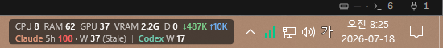
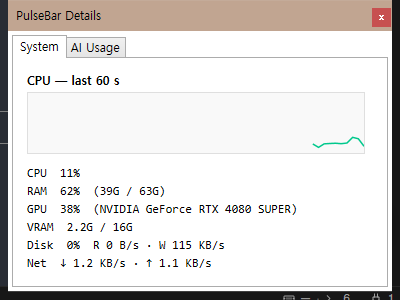
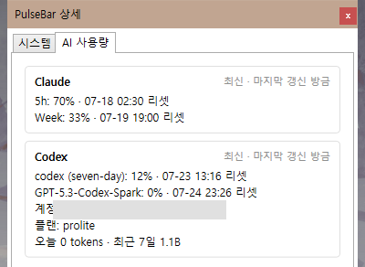

<div align="center">

# ⚡ PulseBar

**Your system. Your AI quotas. One glance at the taskbar.**

*A featherweight Windows widget that lives next to your system tray and shows real-time system stats plus your **Claude Code** and **Codex** usage limits — so you never get surprised by a rate limit mid-flow again.*

[](https://github.com/Hitbee-dev/PulseBar/releases/latest)
[](https://github.com/Hitbee-dev/PulseBar/releases)
[](LICENSE)
[](https://dotnet.microsoft.com/)
[](https://github.com/Hitbee-dev/PulseBar/releases/latest)
[](tests)
[](https://github.com/Hitbee-dev/PulseBar/pulls)

**English** · [한국어](README.ko.md)



`CPU · RAM · GPU · VRAM · Disk · Net` &nbsp;+&nbsp; `Claude 5h/weekly` &nbsp;+&nbsp; `Codex limits` — **updated every second, right on your taskbar.**

</div>

---

## 💡 Why PulseBar?

If you code with **Claude Code** or **Codex**, your real constraints are invisible: *how much of my 5-hour window is left? When does the weekly limit reset? Is this box swapping while the agent runs?* Alt-tabbing to check kills your flow.

PulseBar puts all of it **two pixels from your clock** — using only **official interfaces** (Claude Code statusline & OpenTelemetry, `codex app-server` JSON-RPC). No scraping, no credential access, no Electron eating 400 MB of RAM.

## ✨ Key Features

- 🖥️ **Real-Time System Stats** — CPU, RAM, GPU, VRAM, disk activity, and network throughput sampled every second via native Windows APIs (PDH English counters + DXGI). GPU% uses Task-Manager-style busiest-engine aggregation, so the numbers actually match what you expect.

- 🤖 **Claude Code Quota, Live** — official 5-hour and weekly used-percentages with exact reset times, straight from Claude Code's statusline feed. Values age visibly: anything older than 10 minutes is marked *stale*, never passed off as current.

- 🧩 **Plays Nice with Your Statusline HUD** — already running claude-hud or a custom statusline? PulseBar *wraps* it with your consent: your HUD renders exactly as before while PulseBar reads the same JSON in passing. Original command preserved verbatim, `settings.json` backed up first, nothing ever overwritten.

- 🚦 **Codex Limits + One-Click Login** — every rate-limit bucket from the official `codex app-server` (classified by window duration, so new buckets Just Work), plan, credits, and daily/lifetime token activity. Not logged in? One click opens the official browser login; numbers appear the moment it completes.

- 🧮 **Local Token Telemetry** — count the actual model tokens (input / output / cache-read / cache-creation) your machine's Claude Code consumes, per model, today and last 7 days — via Claude Code's official OpenTelemetry export into a loopback-only receiver. Set up only by your explicit *Claude login* click, never automatically. **Prompts and responses are never collected. Ever.**

- 🐧 **Windows + WSL, First-Class** — auto-detects `claude`/`codex` on Windows *and* inside every WSL distro. Version-aware: when snap, nvm, and `~/.local/bin` installs coexist, PulseBar probes each and picks the newest — stale binaries that break against current server APIs get skipped automatically.

- 📊 **Detail Popup** — left-click for a 60-second CPU graph, full system breakdown, and per-provider cards with reset times, plan, account, credits, and token totals.

- 🌏 **Korean / English UI** — switch live in settings.

- 🔒 **Privacy by Architecture** — loopback-only listeners, DPAPI-protected secrets, zero outbound telemetry, zero credential reads. See [Security](#-security--privacy).

- 🪶 **Featherweight** — a single WPF app. < 0.5% idle CPU, no admin rights, no services, no Docker, no drama.

## 📸 Screenshots

| 🖥️ System tab — 60s CPU graph | 🤖 AI usage tab — provider cards |
|:---:|:---:|
|  |  |

## 🚀 Quick Start

> **Requirements:** Windows 10/11 x64 · no admin rights · no runtime installs (self-contained build)

### Option 1 — Download (recommended)

1. Grab **`PulseBar-portable-win-x64.zip`** from the [**latest release**](https://github.com/Hitbee-dev/PulseBar/releases/latest)
2. Unzip anywhere → run **`PulseBar.exe`**
3. System stats appear on your taskbar instantly ✨

### Option 2 — Build from source

```powershell
git clone https://github.com/Hitbee-dev/PulseBar.git
cd PulseBar
powershell -ExecutionPolicy Bypass -File packaging/portable/build-portable.ps1
# → artifacts/PulseBar-portable-win-x64.zip (+ SHA-256)
```

### Connect your AI tools (one-time, ~30 seconds)

| Step | Action | What happens |
|---|---|---|
| 1 | Tray right-click → **Codex login** | Official browser login; limits appear on completion |
| 2 | Tray right-click → **Claude login** | One click sets up both the usage bridge (statusline) and local token telemetry (official OTel). An existing HUD is only wrapped after you confirm — declining leaves your settings untouched. Restart Claude Code once |

## 📖 Reading the Bar

```
CPU 11  RAM 62  GPU 39  VRAM 3.5G  D 0  ↓5K ↑14K
Claude 5h 69 · W 33  |  Codex W 12
```

| Token | Meaning |
|---|---|
| `CPU 11` / `RAM 62` / `GPU 39` | Usage in % (GPU = busiest engine of your primary adapter) |
| `VRAM 3.5G` | Dedicated video memory in use |
| `D 0` | Disk activity % |
| `↓5K ↑14K` | Network down / up per second |
| `Claude 5h 69 · W 33` | 69% of the 5-hour window, 33% of the weekly window used |
| `Codex W 12` | 12% of the Codex weekly limit used |

Missing data shows `—` (never a fake `0`) · stale data is labeled · **hover** for reset times & token totals · **left-click** for details · **right-click** for the menu.

## ⚖️ Two Numbers That Must Never Be Confused

```
Claude weekly usage 33%      ← server-side account quota (official value)
Fable last 7 days 12.4M tok  ← this PC's local telemetry (other devices/web NOT included)
```

Tools that blend these into one "percentage" are guessing. PulseBar keeps them separate — visually and semantically — always.

## 🔐 Security & Privacy

| Principle | How |
|---|---|
| No credential access | Codex auth stays inside `codex app-server`; Claude auth stays inside Claude Code. No cookie or Credential Manager reads |
| No content collection | Token **counts** and request metadata only — prompts/responses/transcripts are never read, logged, or stored |
| Loopback only | OTLP receivers bind `127.0.0.1` with DPAPI-protected bearer secrets |
| Safe settings edits | Timestamped backup → add-only-when-absent → atomic write. Foreign settings never touched without explicit consent |
| No phoning home | PulseBar sends zero telemetry anywhere |
| No admin, no injection | Runs as a normal user; never injects into Explorer or patches the taskbar |

Full policy: [docs/security.md](docs/security.md)

## 🛠️ Development

```powershell
dotnet build PulseBar.sln -c Release
dotnet test  PulseBar.sln -c Release --no-build   # 180 tests
```

| Project | Role |
|---|---|
| `PulseBar.App` | WPF host — overlay, detail popup, tray, DI |
| `PulseBar.Core` | Models, provider contract, config, i18n, formatters |
| `PulseBar.Windows` | PDH/DXGI metrics, taskbar interop, CLI detection, DPAPI |
| `PulseBar.Providers.Codex` | `codex app-server` JSON-RPC client + login flow |
| `PulseBar.Providers.Claude` | Statusline bridge/installer, OTel parser |
| `PulseBar.Bridge` | Statusline & WSL OTel helper executable |
| `PulseBar.Storage` | SQLite token-event store (idempotent, 30-day retention) |

**Stack:** .NET 8 LTS · WPF · SQLite · xUnit — deliberately **no** Electron, web views, resident Node/Python daemons, Docker, or admin drivers.

## 🗺️ Roadmap

- [ ] Secondary-monitor taskbar support
- [ ] More providers via the Provider Adapter contract — **Gemini CLI**, **GitHub Copilot**, **Cursor**
- [ ] Color thresholds & display-item customization UI
- [ ] Signed binaries + winget package

Ideas welcome → [open an issue](https://github.com/Hitbee-dev/PulseBar/issues)

## 🧰 Troubleshooting

Common fixes (statusline merge, stale data meanings, counter availability) live in [docs/troubleshooting.md](docs/troubleshooting.md). Logs: `%LOCALAPPDATA%\PulseBar\logs\`.

## 🤝 Contributing

PRs and issues are very welcome! Good first contributions: new provider adapters, translations, taskbar edge cases. Please run `dotnet test` before submitting.

## 📄 License

[MIT](LICENSE) © 2026 Hitbee-dev

---

<div align="center">

**If PulseBar saves you from one surprise rate limit, drop it a ⭐ — it helps others find it.**

</div>
